# Exocortex Public Ontologies

Публичные онтологии для системы управления знаниями [Exocortex](https://github.com/kitelev/exocortex).

## Структура (Clean Architecture + DDD)

```
03 Knowledge/
├── core/           # Shared Kernel — базовые абстракции
│   ├── core__Asset.md          # Базовая единица знаний
│   ├── core__Reference.md      # Ссылка на ассет
│   └── core__Relation.md       # Связь между ассетами
│
├── meta/           # Meta-modeling — мета-классы
│   ├── meta__Class.md          # Описание класса
│   ├── meta__Property.md       # Описание свойства
│   ├── meta__Constraint.md     # Ограничение валидации
│   └── meta__Cardinality.md    # Кардинальность свойства
│
├── domain/         # Bounded Contexts — домены
│   └── ems/                    # Effort Management System
│       ├── ems__Task.md        # Задача
│       ├── ems__Project.md     # Проект
│       ├── ems__Area.md        # Область ответственности
│       ├── ems__Prototype.md   # Шаблон задачи
│       └── ems__Effort.md      # Трекинг времени (mixin)
│
├── application/    # Use Cases — команды и формы
│   ├── commands/               # Команды
│   │   ├── cmd__Command.md     # Базовый класс команды
│   │   ├── cmd__CreateTask.md  # Создать задачу
│   │   ├── cmd__StartTask.md   # Начать задачу
│   │   ├── cmd__CompleteTask.md# Завершить задачу
│   │   └── cmd__Search.md      # Поиск по базе
│   └── forms/                  # Формы
│       ├── form__Form.md       # Базовый класс формы
│       ├── form__FormField.md  # Поле формы
│       └── form__LinkField.md  # Поле-ссылка на ассет
│
└── presentation/   # Platform-specific — реализации для платформ
    └── obsidian/
        ├── layouts/            # Визуальные шаблоны
        │   ├── layout__Layout.md
        │   └── layout__TaskLayout.md
        ├── groundings/         # Реализации команд
        │   ├── grnd__Grounding.md
        │   └── grnd__CreateTaskGrounding.md
        └── ui/                 # UI-компоненты
            └── !ui.md
```

## Диаграмма классов

```mermaid
classDiagram
    direction TB

    %% =========================================================================
    %% CORE LAYER (Shared Kernel)
    %% =========================================================================
    namespace core {
        class Resource {
            <<root>>
        }
        class Asset {
            +label: String
            +description: String
            +uri: String
            +created: DateTime
            +modified: DateTime
        }
        class Reference {
            +target: Asset
        }
        class Relation {
            +source: Asset
            +target: Asset
            +type: ObjectProperty
        }
        class Class {
            <<metaclass>>
        }
        class Property
        class ObjectProperty
        class DatatypeProperty
        class StringProperty
        class NumberProperty
        class BooleanProperty
        class DateProperty
        class DateTimeProperty
        class Ontology {
            +url: String
        }
    }

    Resource <|-- Asset
    Resource <|-- Class
    Resource <|-- Property
    Resource <|-- Ontology
    Asset <|-- Reference
    Asset <|-- Relation
    Property <|-- ObjectProperty
    Property <|-- DatatypeProperty
    DatatypeProperty <|-- StringProperty
    DatatypeProperty <|-- NumberProperty
    DatatypeProperty <|-- BooleanProperty
    DatatypeProperty <|-- DateProperty
    DatatypeProperty <|-- DateTimeProperty

    %% =========================================================================
    %% META LAYER
    %% =========================================================================
    namespace meta {
        class MetaClass["meta__Class"] {
            +superClass: Class[]
            +description: String
        }
        class MetaProperty["meta__Property"] {
            +domain: Class
            +range: Class
            +description: String
        }
        class Constraint {
            +property: Property
            +message: String
        }
        class Cardinality {
            +min: Number
            +max: Number
        }
    }

    Class <|.. MetaClass : extends
    Property <|.. MetaProperty : extends
    Resource <|-- Constraint
    Resource <|-- Cardinality

    %% =========================================================================
    %% DOMAIN LAYER - EMS
    %% =========================================================================
    namespace domain_ems {
        class Effort {
            <<mixin>>
            +startTimestamp: DateTime
            +endTimestamp: DateTime
        }
        class Task {
            +project: Project
            +area: Area
            +prototype: Prototype
            +priority: Number
            +dueDate: Date
        }
        class Project {
            +area: Area
            +status: String
            +dueDate: Date
        }
        class Area {
            +parent: Area
        }
        class Prototype {
            +area: Area
            +defaultDuration: Number
        }
    }

    Asset <|-- Task
    Asset <|-- Project
    Asset <|-- Area
    Asset <|-- Prototype
    Effort <|.. Task : mixin
    Task --> Project : project
    Task --> Area : area
    Task --> Prototype : prototype
    Project --> Area : area
    Area --> Area : parent
    Prototype --> Area : area

    %% =========================================================================
    %% APPLICATION LAYER
    %% =========================================================================
    namespace application {
        class Command {
            <<abstract>>
            +name: String
            +description: String
            +category: String
            +hotkey: String
            +contextType: Class
            +targetType: Class
            +form: Form
        }
        class CreateTask
        class StartTask
        class CompleteTask
        class Search
        class Form {
            +fields: FormField[]
        }
        class FormField {
            <<abstract>>
            +name: String
            +label: String
            +type: String
            +required: Boolean
        }
        class LinkField {
            +targetType: Class
        }
    }

    Command <|-- CreateTask
    Command <|-- StartTask
    Command <|-- CompleteTask
    Command <|-- Search
    FormField <|-- LinkField
    Command --> Form : form
    Command --> Class : contextType
    Form --> FormField : fields

    %% =========================================================================
    %% PRESENTATION LAYER
    %% =========================================================================
    namespace presentation {
        class Layout {
            +targetType: Class
            +sections: String[]
            +isDefault: Boolean
        }
        class TaskLayout
        class Grounding {
            +command: Command
            +platform: String
            +status: String
            +capabilities: String[]
        }
        class CreateTaskGrounding
    }

    Layout <|-- TaskLayout
    Grounding <|-- CreateTaskGrounding
    Layout --> Class : targetType
    Grounding --> Command : command
```



> 📁 PlantUML версия: [docs/class-diagram.puml](./docs/class-diagram.puml)

## Принципы архитектуры

### Слои (Clean Architecture)

| Слой | Зависит от | Описание |
|------|------------|----------|
| **core** | ничего | Shared Kernel — базовые абстракции |
| **meta** | core | Мета-моделирование (классы, свойства) |
| **domain** | core, meta | Бизнес-логика (Task, Project) |
| **application** | core, meta, domain | Use Cases (команды, формы) |
| **presentation** | все | Platform-specific (Obsidian layouts) |

### Low Coupling + High Cohesion

- **Low Coupling**: слои зависят только от внутренних слоёв
- **High Cohesion**: связанные концепции сгруппированы вместе
- **Single Responsibility**: каждая онтология имеет одну цель
- **Bounded Contexts**: доменная логика изолирована в domain/

## Формат файлов

Каждый файл — Markdown с YAML frontmatter (как в vault-2025):

```yaml
---
exo__Asset_uid: a1b2c3d4-ems-0001-0000-000000000001
exo__Asset_isDefinedBy: "[[!ems]]"
exo__Instance_class:
  - "[[meta__Class]]"
exo__Class_superClass:
  - "[[ems__Effort]]"
exo__Class_description: Единица работы с отслеживанием времени
---
```

**Правила:**
- Только frontmatter, минимальный markdown body
- Каждое свойство — отдельный файл (`ems__Task_project.md`)
- Онтологии обозначаются `!` (`!ems.md`)
- Ссылки через wikilinks: `[[ems__Task]]`

## Установка

```bash
# Клонировать репозиторий
git clone https://github.com/kitelev/exocortex-public-ontologies.git

# Скопировать в vault
cp -r exocortex-public-ontologies/03\ Knowledge/ /path/to/vault/

# Или симлинк
ln -s $(pwd)/exocortex-public-ontologies/03\ Knowledge /path/to/vault/03\ Knowledge
```

## Экспорт

| Файл | Формат | Описание |
|------|--------|----------|
| `ontologies.nt` | N-Triples | Машиночитаемый |
| `ontologies.ttl` | Turtle | Человекочитаемый |

```bash
npx @kitelev/exocortex-cli sparql query \
  --vault . --format ntriples \
  "CONSTRUCT { ?s ?p ?o } WHERE { ?s ?p ?o }" > ontologies.nt
```

## См. также

- [Exocortex](https://github.com/kitelev/exocortex) — основной репозиторий
- [CLAUDE.md](./CLAUDE.md) — инструкции для AI-ассистентов

## Лицензия

MIT
