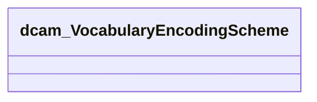

# DCAM Ontology Diagram

UML-style class diagram for the **dcam** namespace.

*Generated automatically. Classes: 1, Properties: 3*

**Legend:**
- `<|--` Inheritance (rdfs:subClassOf)
- `-->` Object Property
- `..>` Datatype Property

## Statistics

| Metric | Count |
|--------|-------|
| Classes | 1 |
| Properties | 3 |
| Inheritance relationships | 0 |
| Properties with domain | 0 |
| Properties with range | 1 |
