# DCTERMS Ontology Diagram

UML-style class diagram for the **dcterms** namespace.

*Generated automatically. Classes: 22, Properties: 55*

**Legend:**
- `<|--` Inheritance (rdfs:subClassOf)
- `-->` Object Property
- `..>` Datatype Property

```mermaid
classDiagram
    class rdfs_Class
    class dcterms_Agent
    class dcterms_AgentClass
    class dcterms_BibliographicResource
    class dcterms_FileFormat
    class dcterms_Frequency
    class dcterms_Jurisdiction
    class dcterms_LicenseDocument
    class dcterms_LinguisticSystem
    class dcterms_Location
    class dcterms_LocationPeriodOrJurisdiction
    class dcterms_MediaType
    class dcterms_MediaTypeOrExtent
    class dcterms_MethodOfAccrual
    class dcterms_MethodOfInstruction
    class dcterms_PeriodOfTime
    class dcterms_PhysicalMedium
    class dcterms_PhysicalResource
    class dcterms_Policy
    class dcterms_ProvenanceStatement
    class dcterms_RightsStatement
    class dcterms_SizeOrDuration
    class dcterms_Standard
    dcterms_RightsStatement <|-- dcterms_LicenseDocument
    dcterms_MediaType <|-- dcterms_FileFormat
    dcterms_MediaTypeOrExtent <|-- dcterms_MediaType
    dcterms_LocationPeriodOrJurisdiction <|-- dcterms_PeriodOfTime
    dcterms_MediaType <|-- dcterms_PhysicalMedium
    dcterms_LocationPeriodOrJurisdiction <|-- dcterms_Location
    dcterms_MediaTypeOrExtent <|-- dcterms_SizeOrDuration
    rdfs_Class <|-- dcterms_AgentClass
    dcterms_LocationPeriodOrJurisdiction <|-- dcterms_Jurisdiction
```

## Statistics

| Metric | Count |
|--------|-------|
| Classes | 22 |
| Properties | 55 |
| Inheritance relationships | 9 |
| Properties with domain | 1 |
| Properties with range | 6 |
