# DOAP Ontology Diagram

UML-style class diagram for the **doap** namespace.

*Generated automatically. Classes: 13, Properties: 43*

**Legend:**
- `<|--` Inheritance (rdfs:subClassOf)
- `-->` Object Property (owl:ObjectProperty)
- `..>` Datatype Property (owl:DatatypeProperty)

```mermaid
classDiagram
    class b618e93d
    class foaf_Organization
    class _459c0d94
    class foaf_Agent
    class rdfs_Literal
    class sioc_Container
    class foaf_Person
    class foaf_Project
    class b720839f
    class rdfs_Resource
    class doap_ArchRepository
    class doap_BazaarBranch
    class doap_BKRepository
    class doap_CVSRepository
    class doap_DarcsRepository
    class doap_GitBranch
    class doap_GitRepository
    class doap_HgRepository
    class doap_Project
    class doap_Repository
    class doap_Specification
    class doap_SVNRepository
    class doap_Version
    rdfs_Resource <|-- doap_Specification
    doap_Repository <|-- doap_GitBranch
    doap_Repository <|-- doap_BKRepository
    doap_Repository <|-- doap_ArchRepository
    doap_Repository <|-- doap_CVSRepository
    doap_Repository <|-- doap_SVNRepository
    b720839f <|-- doap_Project
    foaf_Project <|-- doap_Project
    doap_Repository <|-- doap_DarcsRepository
    doap_Repository <|-- doap_BazaarBranch
    doap_Repository <|-- doap_GitRepository
    doap_Repository <|-- doap_HgRepository
```

## Statistics

| Metric | Count |
|--------|-------|
| Classes | 13 |
| Properties | 43 |
| Inheritance relationships | 12 |
| Properties with domain | 38 |
| Properties with range | 29 |
