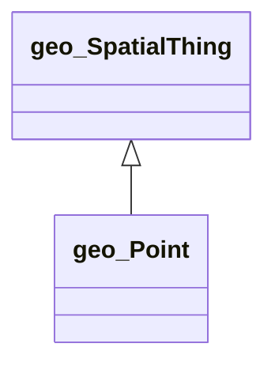

# GEO Ontology Diagram

UML-style class diagram for the **geo** namespace.

*Generated automatically. Classes: 2, Properties: 5*

**Legend:**
- `<|--` Inheritance (rdfs:subClassOf)
- `-->` Object Property
- `..>` Datatype Property

```mermaid
classDiagram
    class geo_Point
    class geo_SpatialThing
    geo_SpatialThing <|-- geo_Point
```

## Statistics

| Metric | Count |
|--------|-------|
| Classes | 2 |
| Properties | 5 |
| Inheritance relationships | 1 |
| Properties with domain | 2 |
| Properties with range | 0 |
