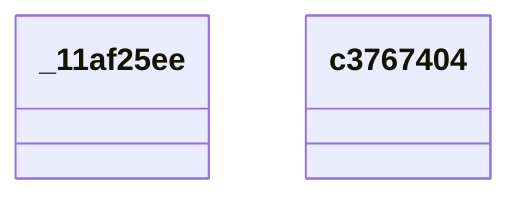

# QUDT Ontology Diagram

UML-style class diagram for the **qudt** namespace.

*Generated automatically. Classes: 2, Properties: 0*

**Legend:**
- `<|--` Inheritance (rdfs:subClassOf)
- `-->` Object Property
- `..>` Datatype Property

## Statistics

| Metric | Count |
|--------|-------|
| Classes | 2 |
| Properties | 0 |
| Inheritance relationships | 0 |
| Properties with domain | 0 |
| Properties with range | 0 |
