# SCHEMA Ontology Diagram

UML-style class diagram for the **schema** namespace.

*Generated automatically. Classes: 930, Properties: 1520*

**Legend:**
- `<|--` Inheritance (rdfs:subClassOf)
- `-->` Object Property
- `..>` Datatype Property

```mermaid
classDiagram
    class schema_WebPage
    class schema_BroadcastChannel
    class schema_StatusEnumeration
    class schema_Offer
    class schema_Residence
    class schema_InsertAction
    class schema_Rating
    class schema_ReactAction
    class schema_FinancialService
    class schema_MedicalIndication
    class schema_Enumeration
    class schema_ControlAction
    class schema_RadioChannel
    class schema_UpdateAction
    class schema_LegalService
    class schema_EntertainmentBusiness
    class schema_Thing
    class schema_MediaObject
    class schema_MedicalEntity
    class schema_TechArticle
    class schema_Organization
    class schema_Comment
    class schema_LocalBusiness
    class schema_CreativeWork
    class schema_Vessel
    class schema_Place
    class schema_MoveAction
    class schema_InteractAction
    class schema_NewsArticle
    class schema_CommunicateAction
    class schema_CivicStructure
    class schema_Intangible
    class schema_OrganizeAction
    class schema_3DModel
    class schema_AboutPage
    class schema_AcceptAction
    class schema_Accommodation
    class schema_AccountingService
    class schema_AchieveAction
    class schema_Action
    class schema_ActionAccessSpecification
    class schema_ActionStatusType
    class schema_ActivateAction
    class schema_AddAction
    class schema_AdministrativeArea
    class schema_AdultEntertainment
    class schema_AdultOrientedEnumeration
    class schema_AdvertiserContentArticle
    class schema_AggregateOffer
    class schema_AggregateRating
    class schema_AgreeAction
    class schema_Airline
    class schema_Airport
    class schema_AlignmentObject
    class schema_AllocateAction
    class schema_AmpStory
    class schema_AMRadioChannel
    class schema_AmusementPark
    class schema_AnalysisNewsArticle
    class schema_AnatomicalStructure
    class schema_AnatomicalSystem
    class schema_AnimalShelter
    class schema_Answer
    class schema_Apartment
    class schema_ApartmentComplex
    class schema_APIReference
    class schema_AppendAction
    class schema_ApplyAction
    class schema_ApprovedIndication
    class schema_Aquarium
    class schema_ArchiveComponent
    class schema_ArchiveOrganization
    class schema_ArriveAction
    class schema_Artery
    class schema_ArtGallery
    class schema_Article
    class schema_AskAction
    class schema_AskPublicNewsArticle
    class schema_AssessAction
    class schema_AssignAction
    class schema_Atlas
    class schema_Attorney
    class schema_Audience
    schema_AllocateAction <|-- schema_AcceptAction
    schema_OrganizeAction <|-- schema_AllocateAction
    schema_Intangible <|-- schema_Audience
    schema_CivicStructure <|-- schema_Aquarium
    schema_Article <|-- schema_AdvertiserContentArticle
    schema_Action <|-- schema_AchieveAction
    schema_CommunicateAction <|-- schema_AskAction
    schema_NewsArticle <|-- schema_AnalysisNewsArticle
    schema_InteractAction <|-- schema_CommunicateAction
    schema_NewsArticle <|-- schema_AskPublicNewsArticle
    schema_MoveAction <|-- schema_ArriveAction
    schema_Place <|-- schema_CivicStructure
    schema_Vessel <|-- schema_Artery
    schema_CreativeWork <|-- schema_Atlas
    schema_OrganizeAction <|-- schema_ApplyAction
    schema_LocalBusiness <|-- schema_AnimalShelter
    schema_Comment <|-- schema_Answer
    schema_CreativeWork <|-- schema_ArchiveComponent
    schema_Organization <|-- schema_Airline
    schema_TechArticle <|-- schema_APIReference
    schema_Intangible <|-- schema_ActionAccessSpecification
    schema_MedicalEntity <|-- schema_AnatomicalStructure
    schema_Place <|-- schema_Accommodation
    schema_MediaObject <|-- schema_AmpStory
    schema_CreativeWork <|-- schema_AmpStory
    schema_Thing <|-- schema_Intangible
    schema_AllocateAction <|-- schema_AssignAction
    schema_CreativeWork <|-- schema_MediaObject
    schema_Thing <|-- schema_Action
    schema_EntertainmentBusiness <|-- schema_AdultEntertainment
    schema_LegalService <|-- schema_Attorney
    schema_Action <|-- schema_OrganizeAction
    schema_UpdateAction <|-- schema_AddAction
    schema_AnatomicalStructure <|-- schema_Vessel
    schema_Thing <|-- schema_Organization
    schema_Intangible <|-- schema_AlignmentObject
    schema_Article <|-- schema_NewsArticle
    schema_RadioChannel <|-- schema_AMRadioChannel
    schema_LocalBusiness <|-- schema_LegalService
    schema_Article <|-- schema_TechArticle
    schema_ControlAction <|-- schema_ActivateAction
    schema_MediaObject <|-- schema_3DModel
    schema_Enumeration <|-- schema_AdultOrientedEnumeration
    schema_MedicalIndication <|-- schema_ApprovedIndication
    schema_CivicStructure <|-- schema_Airport
    schema_CreativeWork <|-- schema_Article
    schema_Action <|-- schema_ControlAction
    schema_EntertainmentBusiness <|-- schema_AmusementPark
    schema_Action <|-- schema_AssessAction
    schema_FinancialService <|-- schema_AccountingService
    schema_ReactAction <|-- schema_AgreeAction
    schema_Rating <|-- schema_AggregateRating
    schema_LocalBusiness <|-- schema_EntertainmentBusiness
    schema_InsertAction <|-- schema_AppendAction
    schema_AddAction <|-- schema_InsertAction
    schema_Residence <|-- schema_ApartmentComplex
    schema_Thing <|-- schema_MedicalEntity
    schema_MedicalEntity <|-- schema_AnatomicalSystem
    schema_EntertainmentBusiness <|-- schema_ArtGallery
    schema_Accommodation <|-- schema_Apartment
    schema_Action <|-- schema_InteractAction
    schema_Offer <|-- schema_AggregateOffer
    schema_LocalBusiness <|-- schema_ArchiveOrganization
    schema_LocalBusiness <|-- schema_FinancialService
    schema_Place <|-- schema_AdministrativeArea
    schema_Thing <|-- schema_Place
    schema_StatusEnumeration <|-- schema_ActionStatusType
    schema_Thing <|-- schema_CreativeWork
    schema_BroadcastChannel <|-- schema_RadioChannel
    schema_WebPage <|-- schema_AboutPage
```

## Statistics

| Metric | Count |
|--------|-------|
| Classes | 930 |
| Properties | 1520 |
| Inheritance relationships | 1005 |
| Properties with domain | 0 |
| Properties with range | 0 |
