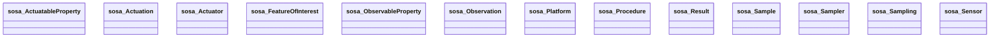

# SOSA Ontology Diagram

UML-style class diagram for the **sosa** namespace.

*Generated automatically. Classes: 13, Properties: 23*

**Legend:**
- `<|--` Inheritance (rdfs:subClassOf)
- `-->` Object Property (owl:ObjectProperty)
- `..>` Datatype Property (owl:DatatypeProperty)

## Statistics

| Metric | Count |
|--------|-------|
| Classes | 13 |
| Properties | 23 |
| Inheritance relationships | 0 |
| Properties with domain | 0 |
| Properties with range | 1 |
