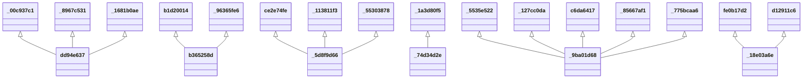

# SSN Ontology Diagram

UML-style class diagram for the **ssn** namespace.

*Generated automatically. Classes: 6, Properties: 15*

**Legend:**
- `<|--` Inheritance (rdfs:subClassOf)
- `-->` Object Property
- `..>` Datatype Property

## Statistics

| Metric | Count |
|--------|-------|
| Classes | 6 |
| Properties | 15 |
| Inheritance relationships | 16 |
| Properties with domain | 0 |
| Properties with range | 0 |
